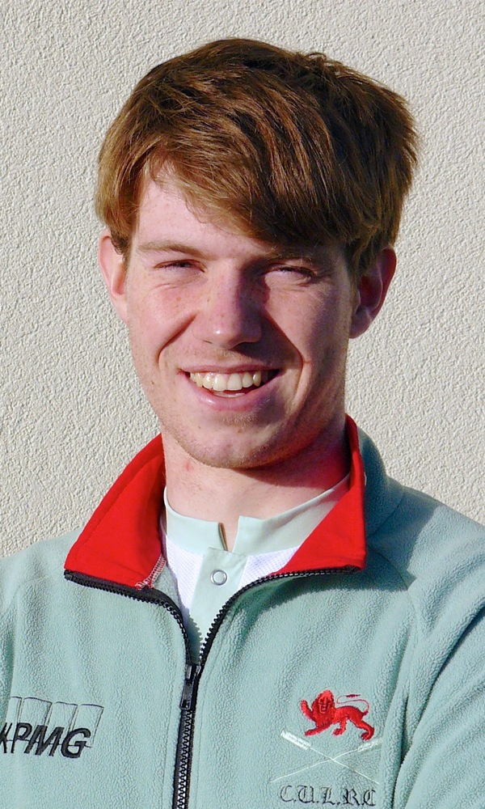
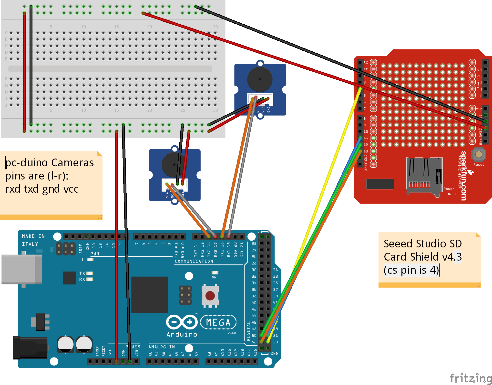
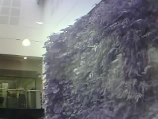
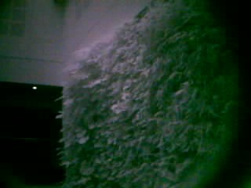
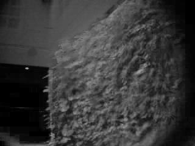

# Low-cost Open-cource Plant Multispectral Imager

## Synopsis

This project was to develop a low-cost open-source multispectral camera for mapping plant health. The commercial units cost at least £3,000 so having an alternative is very desirable. These are cameras that extend the common Red, Green and Blue data channels to include data channels in the Near Infrared (those wavelengths just beyond the red end of our vision). The extra data in this region of the spectrum can reflect the health and diversity of plant matter. The camera developed here was based on an Arduino Mega board, running two pc-duino cameras. By replacing the lenses and fitting one of these with a near-infrared filter it was possible to record two images in these different data channels. There is a latency and writing data is a slow process. Thus this camera is recommended for static applications, such as measuring the health of crop fields

### Team

Jon Williams - PhD Student, Department of Plant Sciences (@jonvw28)

Mayke De Freitas Santos - Technical Adviser and collaborator (@Maykef)

## Software

The software for this project is relatively simple. The arduino sketch Mega_two_camera.ino can be complied to be used on an Arduino Mega. This will initialise the SD shield and cameras. It will then trigger the two cameras by sending appropriate byte commands and will then request data from the cameras. These data will be read sequentially and saved to two files on the SD card. Resetting the Arduino will then start the process again. The additional file get_ndvi.py contains a python script which can be used to generate a normalise difference vegetation index (NDVI) mao

## Hardware

The hardware is simply two pc-duino cameras connected to an Arduino Mega with an SD card shield. Non-stock lenses are used with these (to avoid IR-filtering), and one of the lenses is fitted with a Nearinfrared filter.

## Installation, Maintenance and Testing Guide

To recreate the build follow the fritzing diagram below. A full list of parts is included in the hardware folder. Note: You will need to replace the lenses and add the filter to one of the cameras. You can mount the cameras in any way you like. Just make sure they are sqaure, adjacent and the lenses are parallel.

Once built compile the arduino sketch to run on the Mega. Hopefully this will work, but in any case I would recommend opening the serial monitor which should give helpful messages if this doesn't work.

With the data on the SD card one can then use the python script get_ndvi.py to generate an NDVI map, and example call to the function is included in the file.

NOTE: with changing lenses it is hard to ensure that the image is focused. I would recommend marking the position of a lens before removing it. The best way to focus a lens is simply to take images through the range of focal lengths until you find a crisp image. Unfortunately this can take some trial and error.

## Example data

Example data is included in the data folder, but below is an example of the RGB, Nearinfrared and NDVI images of the green wall in the David Attenborough Building.

## Issues

The original goal of this project was to build a camera suitable for use on a UAV. This was the reason for using an Arduino system (lower power consumption than a Raspberry Pi). This was hoped to also give us more direct control over the cameras. Unfortunately we were only able to use very user-friendly but minimal user-control camera units. As a result we found that simultaneous capture wasn't guaranteed, and could be as much as 1 second gap as shown on our poster from the Biomaker Fayre. Addtionally, as all of the data must be passed through the Arduino this can take a lot of time. In summary, this camera is good for static images, but isn't really suitable for the intended UAV application.

## Further Work

There are a few further options for developing this project. One could look into alternative camera modules to see if any of these allow a lower level of control over the image capture which could help with some of the above issues. A second addition could be to add two further camera modules (one in Serial3 and one using a Software Serial connection). These could sample at the lowest resolution, one in RGB and one in Near infrared and be used to record the illumination conditions from behind the camera. This would allow maprs of reflectance to be compiled, by applying a correction for illumination.

## License

See the License File for details

## Acknowledgements

Many thanks to the Biomaker Challenge Organisers for the funding to develop this project.